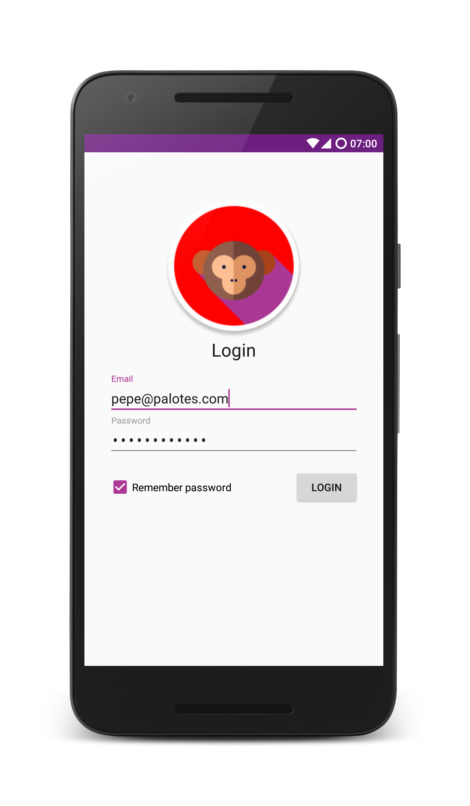
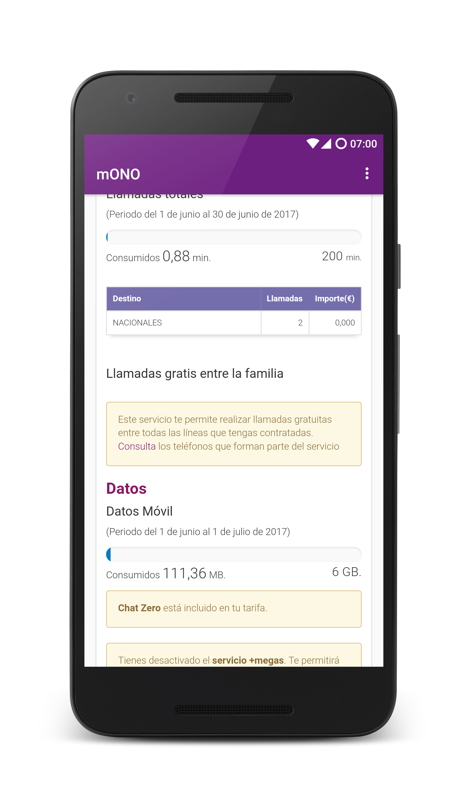

  

# mONO 

mONO is an open source app that serves as a client area viewer for ONO clients.
It was created because the official app sucks and won't even let some users log in.

## Features
* Will let you log in.
* Will store your username and password for you.
* Will not run around or desert you.

## Have some screenshots

  |   |  |
  | --- | --- |

## Contributing

This app is developed on my free time, mostly when I feel like it.
That means it could be much, much better.

Pull requests are welcome. Please do consider that mONO is licensed under the [GNU General Public License v3.0](https://github.com/ontherunvaro/mONO/blob/master/LICENSE), and all contributions are subject to that license.

## Credits
The main icon for mONO is a modified version of [this icon](http://www.flaticon.com/free-icon/monkey_185852) from the user Freepik on [flaticon.com](http://flaticon.com).
It is licensed under the [Flaticon Basic License](http://file000.flaticon.com/downloads/license/license.pdf).
